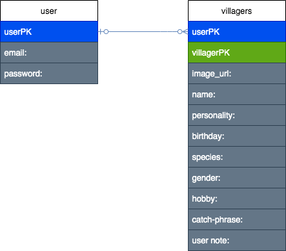
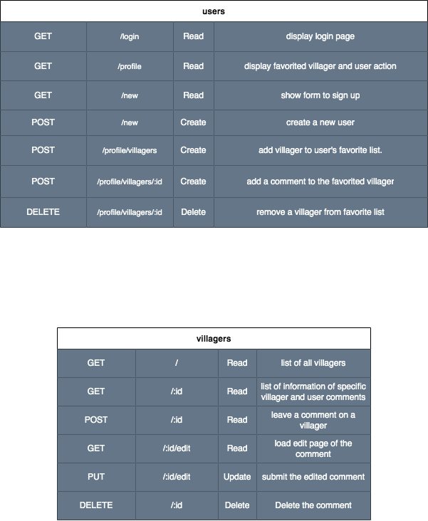
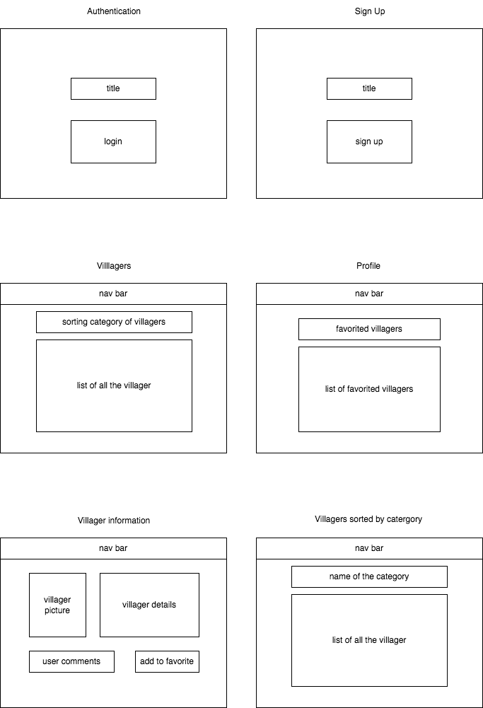

# ACvillagercritic
This project allows you to view list of the villagers from Animal Crossing: New Horizons. Idea is that it helps users to see what kind of villagers there are. Or if you have villagers already it helps to get to know them better. Rate the villagers and see how others feel about the villager!

---
##  API
My choice api is ACNH API which is a free RESTful API. It has information of critters, fossils, art, music, furniture, and villagers. But for this project I'll focusing on villager's information. "https://acnhapi.com/v1a/villagers" will give information of all villagers in an array.

---
## ERD

---
## RESTful Chart

---
## Wireframes

---
## User Stories
- As a user I want to see all the villagers
- As a user I want to see informations about a villager
- As a user I want to add and delete a villager from my favorite list
- As a user I want to leave a comment about villagers that I added

---
## MVP
- login screen with sign up
- home screen with villager list and hyperlink to profile
- profile page with favorited villagers
- be able to add villager to favorite list and delete from favorite list
- being able to log out

---
## Strecth Goals
- able to add a comment and rating on a detail villager page
- see other user's comment and rating on a detail villager page
- list villagers by rating
