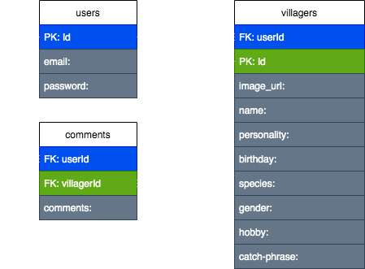

# ACvillagercritic
This project allows you to view list of the villagers from Animal Crossing: New Horizons. Idea is that it helps users to see what kind of villagers there are. Or if you have villagers already it helps to get to know them better. Rate the villagers and see how others feel about the villager!

---
## Installation
- fork and clone the repo
- open project and run `npm install` in terminal
- touch .env and inside the folder type SECRET='this is a secret' PORT='8000' API='https://acnhapi.com/v1a/villagers'
- echo

---
## Link to live site
https://project-2-acvillagercritic.herokuapp.com/

---
##  API
My choice of api is ACNH API which is a free RESTful API. It has information of critters, fossils, art, music, furniture, and villagers. But for this project I'll focusing on villager's information. "https://acnhapi.com/v1a/villagers" will give information of all villagers in an array.

## proof of concept

---
## ERD

---
## RESTful Chart

---
## Wireframes

---
## User Stories
- As a user I want to see all the villagers
- As a user I want to see informations about a villager
- As a user I want to add and delete a villager from my favorite list
- As a user I want to leave a comment on villagers

---
## Technology Used
- JavaScript
- Node.js
- PostgresQL
- Sequelize
- Bootstrap

---
## MVP
- login screen and sign up screen
- home screen
- profile page
- favorite villager list
- all villager list
- be able to add villager to favorite list and delete from favorite list
- comment on villagers and see other user's comment 
- being able to logout

---
## Strecth Goals
- able to add rating on a detail villager page
- see other user's rating on a detail villager page
- list villagers by rating
